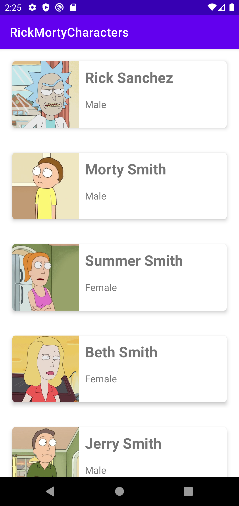
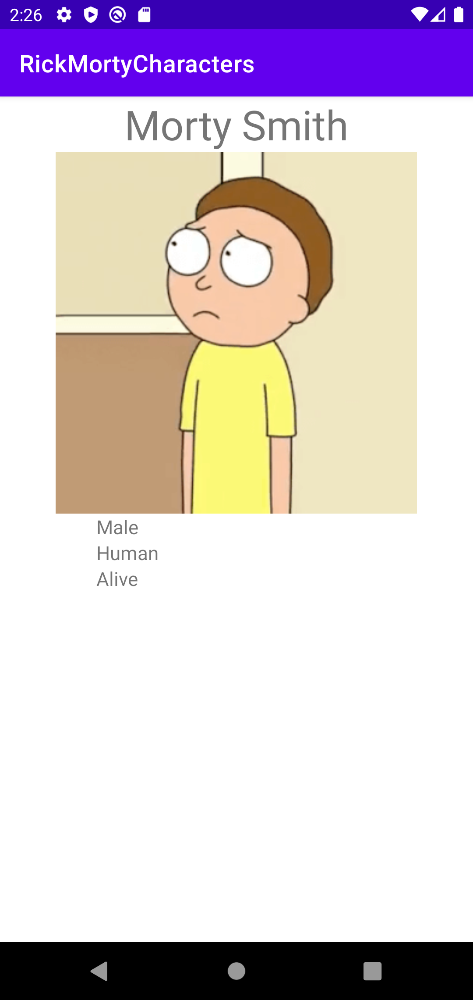

# Projet Java Android pour Franck B.

Ce projet utilise l'API https://rickandmortyapi.com/ pour afficher les personnages de la série animée Rick and Morty.

Le projet a été testé sur l'émulateur "Pixel 4 API 29".

## La liste des personnages

L'application s'ouvre sur la MainActivity qui affiche la liste des personnages grâce à une RecyclerView et un ListAdapter.

J'ai rajouté une fonction statique `getBitmapFromURL` pour récupérer le bitmap correspondant à l'URL d'une image et l'afficher dans une ImageView.

## Le détail d'un personnage

Au clic sur un item de la liste, une autre activity CharacterDetail s'ouvre avec quelques infos supplémentaires sur le personnage sélectionné.

